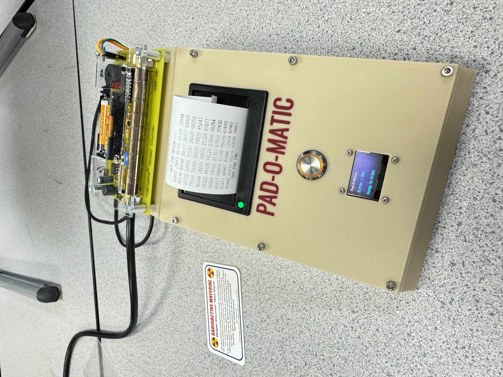

# Pad-O-Matic

Adapted from the original Pad-O-Matic, modified to:
- use a Mighty Ohm geiger counter to generate randomness https://www.adafruit.com/product/483?srsltid=AfmBOoq4lWzNoEGYWhCjgTloVjrkflij2diQ_T4K3CcCHo9Z24fh1inW
- use CircuitPython instead of Arduino C++ 

## Geiger Counter click into random numbers
The method used to create random number is to collect the monotonic time of three clicks (time.monotonic_ns()) if the distance between the first two clicks is greater, it's a 1 otherwise it's a 0. I used this method on my previous [Radiant Dice](https://hackaday.io/project/188240-radiant-dice) project which showed an even distribution over 800,000 clicks.

I have included a datalogging version of the code which uses a Teensy 4.1 because of its SD Card. I have included the bits I've logged for reference/evaluation.

## Worksheets for use in my classroom
- Background/Directions Set: https://docs.google.com/document/d/1qtqCm59j31Vwh4kVkExBnryiyPrK6ayH71Pr0rYz72U/edit?usp=sharing
- Worksheet Set: https://docs.google.com/document/d/1WJP7vVarxA3gz17XbrE9LTpH7ZeNsy7XEmrkfDevATM/edit?usp=sharing

## References
  To see the original IEEE Spectrum Hands On article, visit: https://spectrum.ieee.org/diy-one-time-pad-machine
  Directions adapted from: https://ciphermachinesandcryptology.com/papers/one_time_pad.pdf

